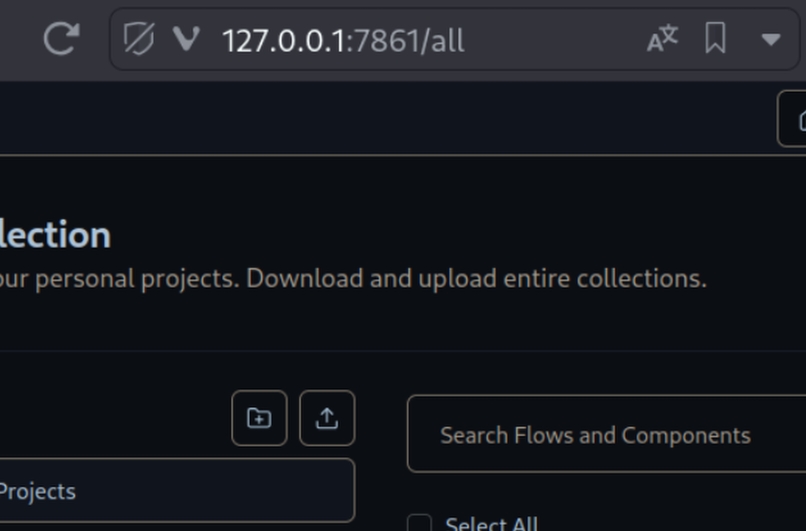

# 1. Installing the Extension

## For Chrome: 

1. Install pnpm globally: `npm install -g pnpm` (check your node version >= 18.12.0)
2. Run `pnpm install`

3. Run:
    - Dev: `pnpm dev`
      - When you run with Windows, you should run as administrator. [(Issue#456)](https://github.com/Jonghakseo/chrome-extension-boilerplate-react-vite/issues/456)
    - Prod: `pnpm build`
4. Open in browser - `chrome://extensions`
5. Check - `Developer mode`
6. Find and Click - `Load unpacked extension`
7. Select - `dist` folder at root

## For Firefox: 

1. Run:
    - Dev: `pnpm dev:firefox`
    - Prod: `pnpm build:firefox`
2. Open in browser - `about:debugging#/runtime/this-firefox`
3. Find and Click - `Load Temporary Add-on...`
4. Select - `manifest.json` from `dist` folder at root

**Remember in Firefox you add the plugin in temporary mode, that means it disappears after closing the browser, and you must do it again on the next launch.**

# 2. Importing Flows into Langflow

To import flows into Langflow, follow these steps:

1. **Install Langflow Locally:**
   Follow the installation guide for setting up Langflow on your local machine. You can find the guide [here](https://docs.langflow.org/getting-started/install-langflow).

   Note: The cloud version uses an older version of Langflow, this can be generate some issues and incompatibilities with the flows.

2. **Run Langflow:**
   Execute `langflow run` in your terminal to start Langflow.

3. **Access Langflow:**
   Once Langflow is up and running, navigate to `/all` in your browser.

   

4. **Import Flows:**
   On the right-hand side of the "Folders" section, you'll find an icon to import a JSON file. Click on this icon to import your JSON flows.
   
    

# 3. Using

